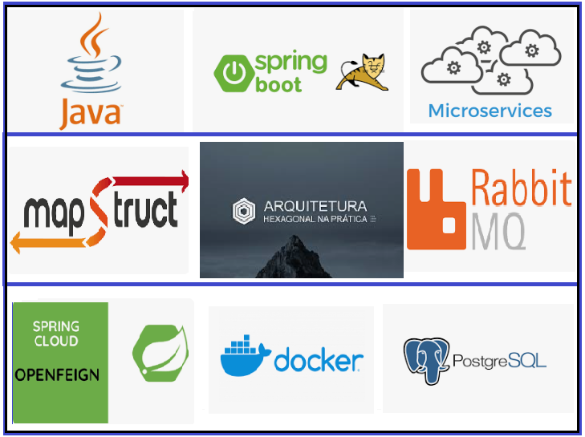

## MICROSERVIÇO COM SPRING BOOT + APLICAÇÃO RODANDO EM DOCKER ##   
Rodar aplicação :   

 

1- Baixe o projeto : url(https://github.com/Cleonides/RepositorioMicroservico.git)   
2- Rode o script.sh (cmd ou terminal) entre na pasta raiz do projeto e execute : ./script.sh  
 2.1 - Se for Linux : sudo ./script.sh   
3- http://localhost:8080/   

Via curl use os comandos para fazer o CRUD  
#Criar usuarios   
curl -X POST -H "Content-Type: application/json" -d "{\"name\": \"Luquinha\", \"age\": 19}" localhost:8080/persons  
curl -X POST -H "Content-Type: application/json" -d "{\"name\": \"Pedrinho\", \"age\": 29}" localhost:8080/persons  
curl -X POST -H "Content-Type: application/json" -d "{\"name\": \"Antonio\", \"age\":  39}" localhost:8080/persons  

#Consultar usuarios   
CURL -X GET -i http://localhost:8080/persons  

#Atualizar usuarios  
curl -X PUT -H "Content-Type: application/json" -d "{\"name\": \"Julninho\", \"age\": 19}" localhost:8080/persons/1   

#Deletar usuarios  
curl -v -X DELETE localhost:8080/persons/7  
 
